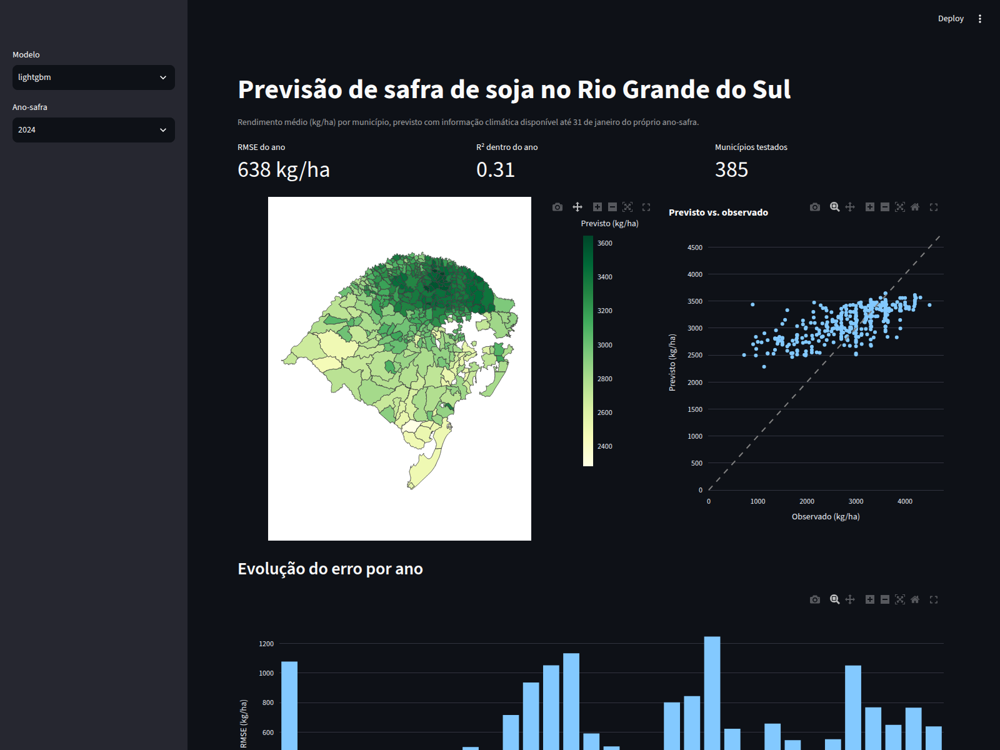

# Previsão de safra de soja no RS

[](https://github.com/SerjaoSanchez/previsao-safra-soja-rs/actions/workflows/ci.yml)

**App publicado:** [previsao-soja-rs.streamlit.app](https://previsao-soja-rs.streamlit.app/)

**Pergunta do projeto:** dá para prever o rendimento médio (kg/ha) de soja por
município do Rio Grande do Sul, para o ano-safra seguinte, usando apenas
informação climática disponível até 31 de janeiro?

## O que isso significa

Todo ano, produtores, seguradoras e traders de commodities precisam estimar
como vai ser a safra de soja *antes* dela terminar. O Rio Grande do Sul é o
estado brasileiro com maior variação de produtividade de um ano para o outro,
porque a soja gaúcha é de sequeiro (não irrigada) e depende diretamente do
regime de chuvas, especialmente de eventos La Niña, que historicamente
coincidem com quebras de safra (2004/05, 2011/12, 2021/22, 2022/23).

Este projeto usa dados públicos de clima, produção agrícola e o índice
climático ONI (El Niño/La Niña) para treinar um modelo que prevê o rendimento
municipal *antes* de a fase mais crítica do ciclo da soja (enchimento de
grão) terminar, usando só o que já se sabe até 31 de janeiro, sem espiar o
futuro.

## Resultado

O melhor modelo (**Ridge sobre as features fenológicas**) erra em média
**613 kg/ha**, validado com validação temporal expansiva (treina só com anos
anteriores, nunca K-fold aleatório) em 33 safras (1987–2024) e ~400
municípios por ano. É **30% melhor que o baseline ingênuo** (média histórica
do município, 882 kg/ha) e **17% melhor que média + tendência linear** (741
kg/ha).

| Modelo | RMSE médio (kg/ha) | vs. baseline histórico |
|---|---:|---:|
| Média histórica do município (baseline) | 882 | referência |
| Média + tendência linear | 741 | -16% |
| LightGBM | 641 | -27% |
| **Ridge** | **613** | **-30%** |

O LightGBM, apesar de mais flexível, **não supera o Ridge**. Isso é esperado,
não um bug: `ano` domina a importância das features (efeito do ganho
genético/tecnológico, ~1-2% a.a.) e árvores de decisão não extrapolam uma
tendência linear além do intervalo visto no treino, enquanto o Ridge
extrapola naturalmente. Ver "Limitações" para os números completos e mais
detalhes.



## Escopo

- **Cultura:** soja (sequeiro: o sinal de estresse hídrico é limpo, diferente
  do arroz irrigado gaúcho).
- **Recorte geográfico:** municípios do Rio Grande do Sul (497).
- **Unidade de análise:** município-ano-safra. São 21.371 combinações brutas
  (497 municípios × 43 anos, 1982–2024), 11.475 após os filtros de
  qualidade (ver `montar_dataset` em `src/soja_rs/train.py`).
- **Corte temporal:** apenas dados disponíveis até 31 de janeiro do ano-safra.
  O projeto é previsão de verdade, não explicação retrospectiva.

## Fontes de dados

| Fonte | Uso | Acesso |
|---|---|---|
| PAM/IBGE (tabela 5457) | Alvo: rendimento médio municipal | API SIDRA |
| CONAB | Validação estadual (nunca como alvo) | Séries históricas |
| NASA POWER | Clima diário em grade por centroide municipal | API pública |
| INMET (opcional) | Validação da grade climática contra estações reais | BDMEP |
| ONI (NOAA) | Índice La Niña/El Niño defasado, disponível antes do plantio | CSV público |

## Estrutura do repositório

```
data/
  raw/          # dados brutos baixados (fora do git)
  interim/      # dados em processamento (fora do git)
  processed/    # dados prontos para modelagem (fora do git)
src/soja_rs/    # código do projeto (o notebook é rascunho; isto é o produto)
notebooks/      # exploração e sanidade
tests/          # testes das funções de features/coleta
reports/        # figuras, métricas, saídas de análise
```

## Como rodar

```bash
make data      # baixa e organiza os dados brutos em DuckDB
make features  # gera as features fenológicas
make train     # treina e valida os modelos (baselines + LightGBM)
make app       # roda o app Streamlit localmente
```

O app também roda sem repetir a coleta/treino: `data/processed/soja_rs.duckdb`
(resultado já processado) e `data/raw/malha/rs_43_municipios.geojson` (malha
municipal) são as duas únicas exceções versionadas dentro de `data/`, só
para o app subir pronto (local ou no Streamlit Cloud) sem esperar os ~30 min
da coleta da NASA POWER. O resto de `data/` (dado bruto, cache das APIs)
continua fora do git.

## Deploy

Publicado no [Streamlit Community Cloud](https://streamlit.io/cloud):
[previsao-soja-rs.streamlit.app](https://previsao-soja-rs.streamlit.app/).

Passo a passo para publicar uma cópia:

1. Entre em [share.streamlit.io](https://share.streamlit.io) com sua conta
   GitHub.
2. "New app" → selecione este repositório, branch `main`.
3. Main file path: `src/soja_rs/app.py`.
4. Deploy. As dependências vêm de `requirements.txt` (que instala o pacote
   via `pyproject.toml`).

## Roadmap

- [x] Fase 0: Fundação (repositório, ambiente, estrutura)
- [x] Fase 1: Dados (PAM/SIDRA, NASA POWER, ONI, DuckDB)
- [x] Fase 2: Features fenológicas (GDD, balanço hídrico, ONI defasado)
- [x] Fase 3: Modelagem (baselines → Ridge → LightGBM, validação temporal)
- [x] Fase 4: Entrega (app Streamlit, CI, README com resultado)

## Limitações

**R² dentro do ano é negativo para todos os modelos** (-1.0 a -2.6). Isso não
é um erro de cálculo: R² dentro de cada ano mede se o modelo acerta *qual
município* vai render mais que outro naquele ano, e nenhum dos modelos supera
"prever a média do ano para todo mundo" nessa tarefa específica. O RMSE
global melhora de verdade (Ridge é 30% melhor que o baseline) porque os
modelos capturam bem a variação *entre anos* (safra boa vs. safra ruim, via
`ano`, `oni_lag_son` e as anomalias climáticas), mas a diferença *entre
municípios vizinhos no mesmo ano* (provavelmente dominada por solo, cultivar
e manejo, nenhum dos quais está no dataset) continua sendo o gargalo.
Reportar isso é mais honesto do que mostrar só o RMSE global, que sobe
sozinho por causa da diferença estrutural entre municípios (ver base.txt).

**LightGBM perde para Ridge** (641 vs. 613 kg/ha de RMSE). Testei mais
regularização (menos profundidade, mais `reg_alpha`/`reg_lambda`, subsample)
e ajudou (661 → 641), mas não o suficiente para superar o Ridge. A hipótese
mais provável: `ano` é de longe a feature mais importante no SHAP (~450,
contra ~155 da segunda colocada), captura o ganho genético/tecnológico anual,
e árvores de decisão não extrapolam uma tendência linear além do intervalo de
anos visto no treino (cada split em `ano` satura no valor máximo do treino),
enquanto a regressão linear do Ridge extrapola a reta naturalmente. Em
validação temporal expansiva, o ano de teste é *sempre* maior que qualquer
ano de treino, então essa limitação do LightGBM pesa em todas as rodadas.

**Enchimento de grão só é observado parcialmente.** O corte de 31/jan cai no
meio da fase mais crítica para o rendimento (R5-R6, que vai até fevereiro).
Floração e o início do enchimento acabaram compartilhando a mesma janela de
dados (`reprodutivo` = janeiro), documentado assim no código
(`src/soja_rs/features.py`) em vez de fingir uma separação que os dados não
sustentam.

**Vazamento encontrado e corrigido durante o desenvolvimento:**
`anomalia_precip_reprodutivo_mm` fica `NaN` nos primeiros ~5 anos de cada
município (a normal climatológica trailing exige histórico mínimo). O
primeiro `montar_dataset()` não descartava essas linhas: em anos de teste
antecipados, o treino inteiro tinha essa coluna `NaN`, a mediana usada pra
imputar também virava `NaN`, e o Ridge quebrava. Corrigido descartando
essas linhas, do mesmo jeito que já era feito para o rendimento histórico.

**Radiação solar da NASA POWER tem ~7% de falhas** na série (mais
concentradas no início dos anos 1980). Não afeta o balanço hídrico, porque a
ET0 é calculada por Hargreaves-Samani usando radiação extraterrestre
astronômica (função de latitude e dia do ano), não a radiação medida.

**Município-anos com área colhida < 500 ha foram descartados**, número que
aparece em quase toda análise agrícola municipal brasileira porque o
rendimento é ruidoso em áreas pequenas. Reduz o dataset de 21.371 para
11.475 linhas.

**Piores anos para o LightGBM** (maior erro absoluto médio): 2013, 1992,
2006, 2005 e 2020. Nenhum deles é 2022 (a seca severa da La Niña, que o
modelo captura relativamente bem via ONI). Os piores anos parecem ser
eventos mais localizados/idiossincráticos (granizo, pragas, geada tardia)
que não aparecem nas variáveis climáticas de grande escala usadas aqui.

**Dois bugs de ambiente que vale registrar** (ambos com causa raiz
encontrada e corrigida, não contornados):
- A coleta da NASA POWER travava com `requests`/`urllib3` porque a
  biblioteca tentava IPv6 primeiro para hosts atrás de CloudFront, e IPv6
  não é roteável neste ambiente, sem fallback rápido pra IPv4 (diferente do
  `curl`, que prioriza IPv4). Corrigido forçando IPv4 via
  `urllib3.util.connection.allowed_gai_family`.
- O mapa coroplético renderizava como um bloco sólido sem distinguir
  município nenhum. Causa: o GeoJSON do IBGE segue a RFC 7946 (anel externo
  anti-horário), mas o Plotly espera sentido horário: com anti-horário ele
  inverte o preenchimento (colore o entorno do polígono, não o polígono).
  Isolado renderizando 1 e depois 5 municípios com kaleido (sem depender de
  navegador) até achar o padrão; corrigido reorientando os anéis no coletor
  da malha.
